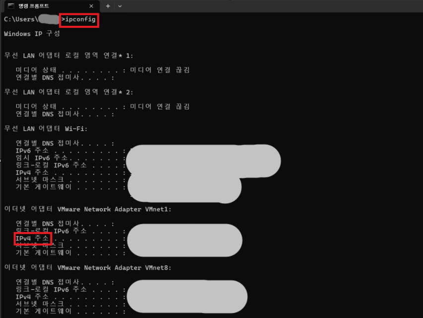

# 🌐 IP Address

## 📖 What is an IP Address?

IP Address(Internet Protocol Address)는
네트워크에서 장치를 구분하기 위한 주소입니다.

---

## 🔑 Types of IP Address

### Private IP

내부 네트워크(집, 회사)에서 사용하는 IP 주소입니다.

예시

- 192.168.x.x
- 10.x.x.x
- 172.16.x.x ~ 172.31.x.x

### Public IP

인터넷에서 사용하는 IP 주소입니다.

공유기를 통해 외부와 통신할 때 사용됩니다.

---

## 💼 In Practice

IT 운영에서는 인터넷 연결이 되지 않을 경우
가장 먼저 현재 PC의 IP 주소가 정상적으로
할당되어 있는지 확인합니다.

Windows에서는 `ipconfig` 명령어를 이용해
현재 IP 주소를 확인할 수 있습니다.

---

## 📷 Practice Screenshot

`ipconfig` 명령어를 실행하여 현재 PC의 IPv4 주소를 확인했습니다.

---

## ✅ What I Learned

IP 주소는 네트워크에서 장치를 식별하기 위한 주소이며,

사설 IP는 내부 네트워크에서,
공인 IP는 인터넷에서 사용된다는 것을 이해했습니다.

---

## 🎤 Interview Answer

### Q. IP Address란 무엇인가요?

> IP Address는 네트워크에서 장치를 식별하기 위한 주소입니다.
> 내부 네트워크에서는 사설 IP를 사용하고,
> 인터넷과 통신할 때는 공인 IP를 사용합니다.
