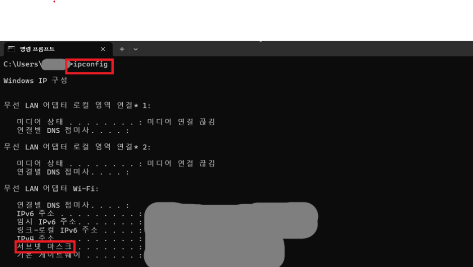

# 🌐 Subnet Mask

## 📖 What is a Subnet Mask?

Subnet Mask는 IP 주소에서 네트워크 영역과 호스트 영역을 구분하는 값입니다.

쉽게 말해, 같은 네트워크에 속하는지 판단하는 기준입니다.

---

## 🔑 Common Subnet Mask

Windows 환경에서는 대부분 다음과 같은 Subnet Mask를 사용합니다.

```text
255.255.255.0
```

예를 들어,

- IP Address : 192.168.0.10
- Subnet Mask : 255.255.255.0

이라면 `192.168.0`은 네트워크를 의미하고,
마지막 `10`은 장치를 구분하는 번호입니다.

---

## 💼 In Practice

IT 운영에서는 PC가 같은 네트워크에 연결되어 있는지 확인하기 위해
IP 주소와 함께 Subnet Mask도 확인합니다.

Windows에서는 `ipconfig` 명령어를 사용하여 확인할 수 있습니다.

---

## 📷 Practice Screenshot

`ipconfig` 명령어를 실행하여 현재 PC의 Subnet Mask를 확인했습니다.



---

## ✅ What I Learned

Subnet Mask는 IP 주소에서 네트워크와 장치를 구분하는 기준이며,
같은 네트워크인지 확인하는 데 사용된다는 것을 이해했습니다.

---

## 🎤 Interview Answer

### Q. Subnet Mask란 무엇인가요?

> Subnet Mask는 IP 주소에서 네트워크 영역과 호스트 영역을 구분하는 값입니다.
> 같은 네트워크에 속하는지 판단하는 기준으로 사용되며,
> Windows에서는 `ipconfig` 명령어를 통해 확인할 수 있습니다.
