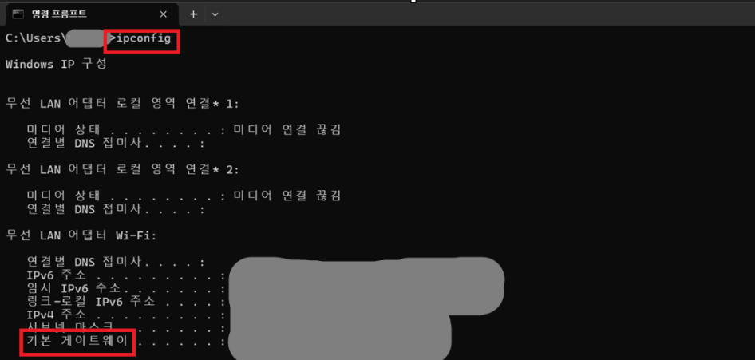

# 🌐 Default Gateway

## 📖 What is a Default Gateway?

Default Gateway는
내 PC가 다른 네트워크와 통신할 때 가장 먼저 거치는 장치입니다.

쉽게 말해, 인터넷으로 나가기 위한 출구입니다.

---

## 🔑 Role of Default Gateway

Gateway는 내부 네트워크와 외부 네트워크를 연결하는 역할을 합니다.

인터넷에 접속하거나 다른 네트워크와 통신할 때
반드시 Gateway를 거쳐 데이터를 전달합니다.

대표적인 Gateway 주소는 다음과 같습니다.

- 192.168.0.1
- 192.168.1.1

---

## 💼 In Practice

IT 운영에서는 인터넷 연결에 문제가 발생했을 때
IP 주소와 함께 Default Gateway가 정상적으로 설정되어 있는지 확인합니다.

Windows에서는 `ipconfig` 명령어를 사용하여 확인할 수 있습니다.

---

## 📷 Practice Screenshot

`ipconfig` 명령어를 실행하여 현재 PC의 Default Gateway를 확인했습니다.

---

## ✅ What I Learned

Default Gateway는 내부 네트워크와 외부 네트워크를 연결하는 장치이며,
인터넷으로 나가기 위한 출구 역할을 한다는 것을 이해했습니다.

---

## 🎤 Interview Answer

### Q. Default Gateway란 무엇인가요?

> Default Gateway는 내부 네트워크와 외부 네트워크를 연결하는 장치입니다.
> 인터넷과 같은 다른 네트워크로 데이터를 전달하는 출구 역할을 하며,
> Windows에서는 `ipconfig` 명령어를 통해 확인할 수 있습니다.
