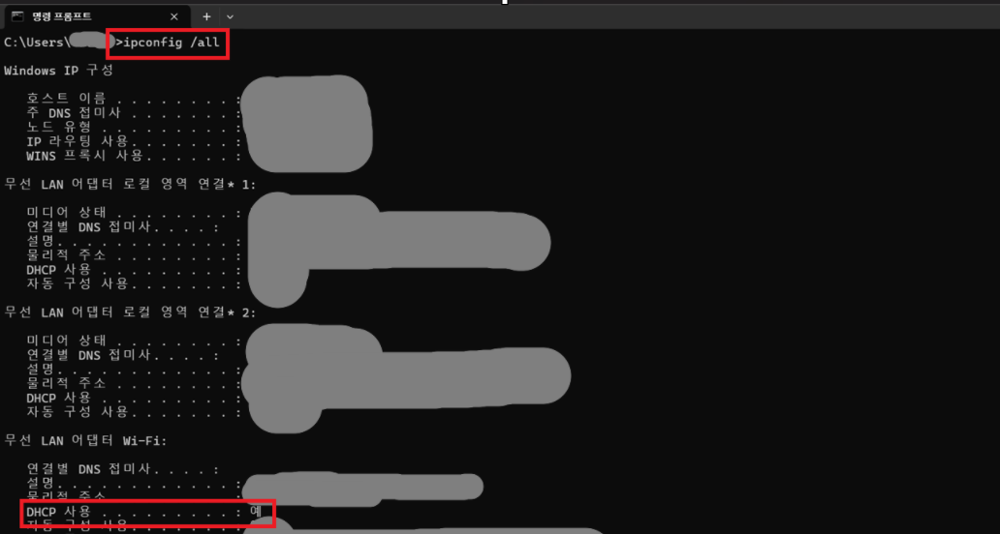

# 🌐 DHCP

## 📖 What is DHCP?

DHCP(Dynamic Host Configuration Protocol)는
네트워크에 연결된 장치에 IP 주소를 자동으로 할당해 주는 서비스입니다.

IP 주소뿐만 아니라 Subnet Mask와 Default Gateway 등의
네트워크 정보도 함께 자동으로 설정해 줍니다.

---

## 🔑 Why is DHCP Important?

DHCP를 사용하면 사용자가 직접 IP 주소를 입력하지 않아도
자동으로 네트워크 설정을 받을 수 있습니다.

회사나 학교처럼 많은 PC를 관리하는 환경에서
효율적인 네트워크 관리가 가능합니다.

---

## 💼 In Practice

IT 운영에서는 PC가 정상적으로 IP 주소를 받았는지 확인하기 위해
`ipconfig /all` 명령어를 사용합니다.

DHCP가 정상적으로 동작하지 않으면
네트워크 연결에 문제가 발생할 수 있습니다.

---

## 📷 Practice Screenshot

`ipconfig /all` 명령어를 실행하여
DHCP 사용 여부를 확인했습니다.

---

## ✅ What I Learned

DHCP는 네트워크에 연결된 장치에
IP 주소와 네트워크 정보를 자동으로 할당해 주는 서비스라는 것을 이해했습니다.

---

## 🎤 Interview Answer

### Q. DHCP란 무엇인가요?

> DHCP(Dynamic Host Configuration Protocol)는 네트워크에 연결된 장치에 IP 주소를 자동으로 할당해 주는 서비스입니다. 또한 Subnet Mask와 Default Gateway 등의 네트워크 정보도 함께 제공하여 사용자가 별도로 설정하지 않아도 네트워크를 사용할 수 있도록 합니다.
