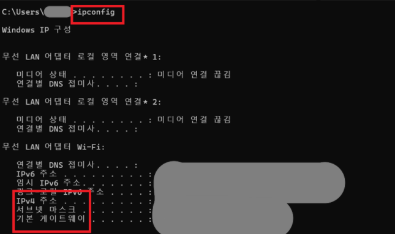

# 🌐 ipconfig Command

## 📖 What is ipconfig?

`ipconfig`는 Windows에서 현재 PC의 네트워크 설정을 확인하는 명령어입니다.

IP 주소, Subnet Mask, Default Gateway 등의 정보를 확인할 수 있으며,
네트워크 문제를 진단할 때 가장 먼저 사용하는 기본 명령어입니다.

---

## 🔑 What Can You Check?

`ipconfig` 명령어를 통해 다음 정보를 확인할 수 있습니다.

- IPv4 Address
- Subnet Mask
- Default Gateway

`ipconfig /all` 명령어를 사용하면 DHCP, DNS 서버, MAC Address 등
더 자세한 네트워크 정보를 확인할 수 있습니다.

---

## 💼 In Practice

IT 운영에서는 인터넷 연결에 문제가 발생하면
가장 먼저 `ipconfig` 명령어를 실행하여
IP 주소와 Subnet Mask, Default Gateway가 정상적으로 설정되어 있는지 확인합니다.

---

## 📷 Practice Screenshot

`ipconfig` 명령어를 실행하여
현재 PC의 네트워크 정보를 확인했습니다.

---

## ✅ What I Learned

`ipconfig`는 현재 PC의 네트워크 설정을 확인하는 가장 기본적인 명령어이며,
네트워크 문제를 진단할 때 가장 먼저 사용하는 명령어라는 것을 이해했습니다.

---

## 🎤 Interview Answer

### Q. ipconfig 명령어는 언제 사용하나요?

> `ipconfig`는 현재 PC의 네트워크 설정을 확인할 때 사용하는 Windows 명령어입니다. IP 주소, Subnet Mask, Default Gateway 등을 확인할 수 있으며, 인터넷 연결 문제나 네트워크 장애를 점검할 때 가장 먼저 사용하는 기본적인 진단 명령어입니다.
