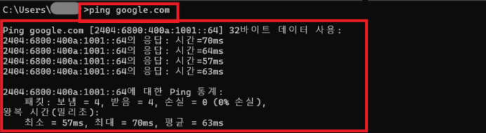

# 🌐 ping Command

## 📖 What is ping?

`ping`은 다른 장치와 네트워크 통신이 가능한지 확인하는 Windows 명령어입니다.

인터넷 연결 상태나 서버와의 통신 여부를 확인할 때 가장 기본적으로 사용됩니다.

---

## 🔑 What Can You Check?

`ping` 명령어를 통해 다음 내용을 확인할 수 있습니다.

- 네트워크 연결 여부
- 서버 응답 여부
- 응답 시간(Response Time)
- 패킷 손실(Packet Loss)

---

## 💼 In Practice

IT 운영에서는 인터넷 연결이 되지 않거나
특정 서버에 접속되지 않을 때 `ping` 명령어를 실행하여
네트워크 연결 상태를 확인합니다.

응답이 정상적으로 오면 기본적인 네트워크 통신은 가능한 상태입니다.

---

## 📷 Practice Screenshot

`ping google.com` 명령어를 실행하여
Google 서버와 정상적으로 통신되는 것을 확인했습니다.

---

## ✅ What I Learned

`ping`은 네트워크 연결 상태를 확인하는 가장 기본적인 명령어이며,
응답 시간과 패킷 손실 여부를 확인하여 네트워크 이상 유무를 진단할 수 있다는 것을 이해했습니다.

---

## 🎤 Interview Answer

### Q. ping 명령어는 언제 사용하나요?

> `ping`은 다른 장치나 서버와의 네트워크 연결 상태를 확인할 때 사용하는 명령어입니다. 인터넷 연결 여부와 응답 시간을 확인할 수 있으며, 네트워크 장애를 진단할 때 가장 먼저 사용하는 기본적인 명령어 중 하나입니다.
