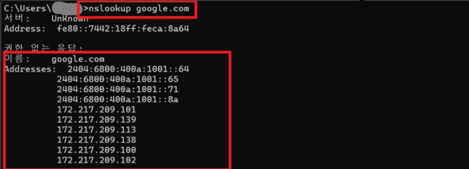

# 🌐 nslookup Command

## 📖 What is nslookup?

`nslookup`은 DNS(Domain Name System)가 도메인 이름을 IP 주소로 정상적으로 변환하는지 확인하는 Windows 명령어입니다.

도메인 이름을 입력하면 해당 도메인의 IP 주소와 DNS 서버 정보를 확인할 수 있습니다.

---

## 🔑 What Can You Check?

`nslookup` 명령어를 통해 다음 내용을 확인할 수 있습니다.

- DNS 서버 정보
- 도메인의 IP 주소
- DNS 정상 동작 여부

---

## 💼 In Practice

IT 운영에서는 특정 웹사이트에 접속되지 않을 경우
`nslookup` 명령어를 사용하여 DNS가 정상적으로 동작하는지 확인합니다.

도메인 이름이 IP 주소로 정상 변환된다면 DNS는 정상적으로 동작하는 상태입니다.

---

## 📷 Practice Screenshot

`nslookup google.com` 명령어를 실행하여
Google 도메인이 IP 주소로 정상 변환되는 것을 확인했습니다.

---

## ✅ What I Learned

`nslookup`은 DNS 서버를 통해 도메인 이름을 IP 주소로 변환하는 결과를 확인하는 명령어이며, DNS 문제를 진단할 때 활용된다는 것을 이해했습니다.

---

## 🎤 Interview Answer

### Q. nslookup 명령어는 언제 사용하나요?

> `nslookup`은 DNS가 도메인 이름을 IP 주소로 정상적으로 변환하는지 확인할 때 사용하는 명령어입니다. 인터넷은 연결되지만 특정 웹사이트에 접속되지 않는 경우 DNS 문제인지 확인하기 위해 자주 사용합니다.
