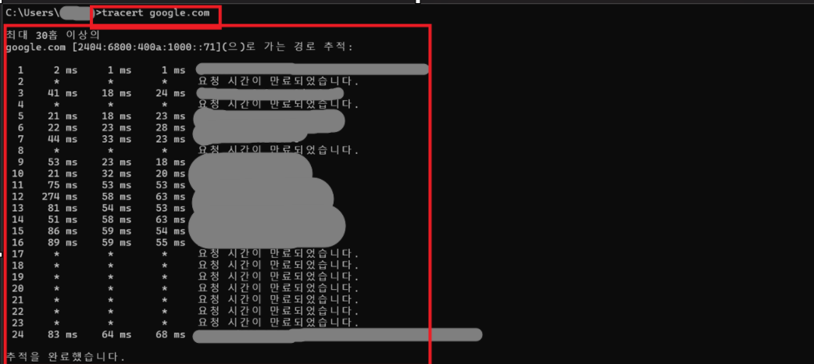

# 🌐 tracert Command

## 📖 What is tracert?

`tracert`는 내 PC에서 목적지 서버까지 데이터가 어떤 경로를 거쳐 이동하는지 확인하는 Windows 명령어입니다.

목적지까지 거치는 라우터(Hop)와 각 구간의 응답 시간을 확인할 수 있습니다.

---

## 🔑 What Can You Check?

`tracert` 명령어를 통해 다음 내용을 확인할 수 있습니다.

- 목적지까지의 네트워크 경로
- 거치는 라우터(Hop)
- 각 구간의 응답 시간
- 지연 또는 통신 문제 발생 위치

---

## 💼 In Practice

IT 운영에서는 특정 서버 접속이 느리거나 네트워크 장애가 발생했을 때 `tracert`를 사용하여 어느 구간에서 문제가 발생하는지 확인합니다.

이를 통해 장애 원인을 보다 효율적으로 분석할 수 있습니다.

---

## 📷 Practice Screenshot

`tracert google.com` 명령어를 실행하여
Google 서버까지의 네트워크 경로를 확인했습니다.

---

## ✅ What I Learned

`tracert`는 목적지까지의 네트워크 경로와 각 구간의 응답 시간을 확인하는 명령어이며, 네트워크 지연이나 장애 위치를 파악하는 데 활용된다는 것을 이해했습니다.

---

## 🎤 Interview Answer

### Q. tracert 명령어는 언제 사용하나요?

> `tracert`는 목적지 서버까지 데이터가 어떤 경로를 거쳐 이동하는지 확인하는 명령어입니다. 네트워크가 느리거나 특정 구간에서 통신 문제가 발생하는 경우 어느 구간에서 문제가 생겼는지 확인하기 위해 사용합니다.
